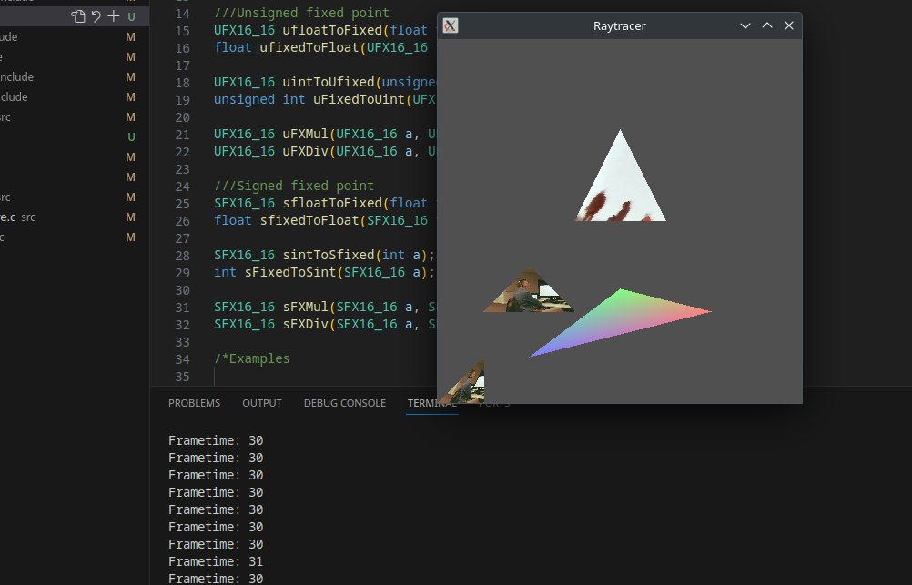
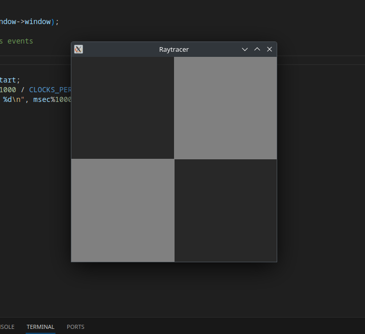

# C_Linux_Raytracer

Current TODO:
* Implement secondary rays
* Implement a perspective camera
* Implement a multithreaded implementation

Clone:
The repo must be cloned with --recursive as it uses stbimage as a submodule.
ie: git clone https://github.com/HakaruN/C_Linux_Raytracer.git --recursive

Build:
Call make

Texture.c is being compiled as a seperate object file becuse it's really slow to compile on my old PPC machine and i'm not modifying it much so I compile it once, modify the rest of the project and then link against the .o file

